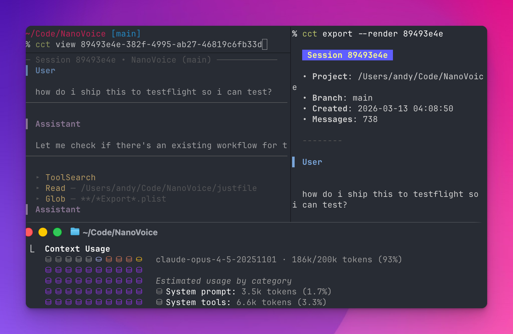

# cct — Search and browse your Claude Code sessions

Claude Code sessions are ephemeral. When you need context from yesterday's debugging session or last week's architecture decision, there's no easy way to find it. `cct` makes your session history searchable — for you and for Claude itself.



> Requires [Claude Code](https://docs.anthropic.com/en/docs/claude-code). macOS and Linux.

## Install

```bash
brew install andyhtran/tap/cct
```

<details>
<summary>Build from source</summary>

```bash
git clone https://github.com/andyhtran/cct.git
cd cct && go build -o cct ./cmd/cct
```

</details>

## Finding past sessions

Search across all your conversations:

```bash
cct search "database migration"       # Find sessions mentioning a topic
cct search "auth bug" -p backend      # Filter to a specific project
```

List recent sessions:

```bash
cct                     # Quick view: 5 most recent
cct list -p myproject   # Filter by project name
cct list -a             # Show all sessions
```

## Getting full context

View a session in your terminal:

```bash
cct view <id>           # Interactive TUI viewer
```

Export to markdown:

```bash
cct export <id>         # Truncated output
cct export <id> --full  # Complete conversation
```

> **Why not `claude --resume`?** There are known issues where resumed sessions don't load full context ([#15837](https://github.com/anthropics/claude-code/issues/15837), [#22107](https://github.com/anthropics/claude-code/issues/22107)). Use `cct view` or `cct export` when you need the complete conversation.

## Resuming work

```bash
cct resume <id>         # cd to project dir and run claude --resume
```

## Use with Claude Code agents

Add to your `CLAUDE.md` to let Claude search your session history:

```markdown
Use `cct search <query>` to find relevant past sessions.
Use `cct export <id> --full` to read full conversation context.
```

Then prompt naturally:

```
use cct to find sessions where we debugged the auth issue
```

This turns your session history into a searchable knowledge base that Claude can query.

## Other commands

```bash
cct info <id>    # Session metadata: project, branch, timestamps
cct stats        # Usage statistics across all projects
```

Run `cct --help` for additional commands.

## JSON output

All commands support `--json` for scripting:

```bash
cct search "bug" --json | jq -r '.[].session.short_id'
```

## How it works

`cct` reads session data from `~/.claude/projects/` (JSONL files). All operations are read-only.

> The Claude Code data format is undocumented and may change between versions.

## License

MIT
